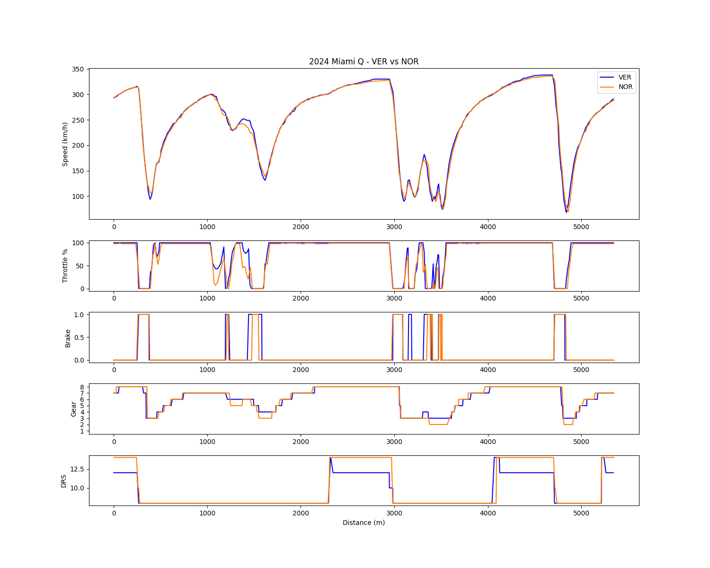

## F1 Vehicle Dynamics & Strategic Analysis: 2024-2025 Paradigm Shift

## プロジェクト概要 (Japanese Summary)
本リポジトリは、F1における車両運動性能（ビークルダイナミクス）とレース戦略の相関を、Pythonおよび公式テレメトリーデータを活用して独自に解析したプロジェクトです。

単なるラップタイムの比較ではなく、FastF1から取得したスロットル開度、ブレーキ踏力、速度遷移などのミクロなデータと、レースペースの推移から読み解くタイヤ劣化傾向等のマクロな戦略データを統合。空力プラットフォームの安定性が、いかにドライバーの操作限界とチームのピット戦略を決定づけるかを定量的に証明しています。

**【使用技術】** Python, FastF1 API, Pandas, NumPy, Matplotlib
**【解析対象】** 2024-2025年シーズンのマクラーレンとレッドブルにおける、空力開発戦争と挙動変化の転換

▼ 出力結果の一例（マイアミGPにおけるトップドライバー2名の挙動比較）

---

## Original Project Details

## 1. Project Overview
This repository contains a comprehensive data-driven analysis of the Formula 1 aerodynamic and strategic development war between McLaren and Red Bull Racing across the 2024 and 2025 seasons. 

By extracting and interpreting high-resolution micro-telemetry (throttle, brake, gear, speed traces) and macro-strategic data (lap-by-lap race pace, thermal degradation trends), this project demonstrates the direct correlation between a vehicle's aerodynamic platform stability and a team's overarching race strategy.

## 2. Methodology & Tech Stack
* **Data Source:** Official F1 timing and telemetry data extracted via the `FastF1` Python library.
* **Analysis Scope:** * **Micro-Dynamics:** Cornering phase breakdown, trail-braking / pitch control analysis, and traction deployment mapping.
  * **Macro-Strategy:** Tire degradation trend analysis, strategic pit-window calculations, and traffic management (DRS trains, VSC implications).
* **Tools Used:** Python, Pandas, Matplotlib, VS Code, Git.

## 3. Case Studies & Reports
The analysis is divided into chronological chapters, tracking the exact inflection points of the championship battle.

* **[Chapter 1: The Baseline Deficit - 2024 China GP](./reports/01_2024_China_Analysis.md)**
  * *Focus:* Identifying the mechanical crutch. How the McLaren MCL38 relied on extreme engine-braking to compensate for a lack of aerodynamic rotation, accelerating thermal degradation.
* **[Chapter 2: The Paradigm Shift - 2024 Miami GP](./reports/02_2024_Miami_Analysis.md)**
  * *Focus:* The aerodynamic cure. Analyzing the upgrade package that neutralized tire degradation by restoring front-end authority and platform stability.
* **[Chapter 3: The Fortress Breached - 2025 Japan GP (Suzuka)](./reports/03_2025_Japan_Analysis.md)**
  * *Focus:* High-speed parity. Demonstrating how McLaren neutralized Red Bull's historic high-speed aerodynamic advantage (in the early-season April conditions) on a highly demanding figure-eight circuit.
* **[Chapter 4: The Architectural Reversal - 2025 Monaco GP](./reports/04_2025_Monaco_Analysis.md)**
  * *Focus:* Driver adaptation. Cross-examining Lando Norris's trail-braking efficiency against Max Verstappen's forced overdriving and severe platform instability on the ultimate street circuit.
* **[Chapter 5: The Ultimate Compromise - 2025 Abu Dhabi GP](./reports/05_2025_Abu_Dhabi_Analysis.md)**
  * *Focus:* Organizational vulnerability. Analyzing Red Bull's extreme low-downforce defensive gamble, McLaren's championship-securing offset pit strategy, and the structural collapse of Red Bull's second-seat philosophy.

## 4. 2026 R&D Outlook
* **[The Evolution of Energy Management - 2025 Japan GP Analysis](./reports/2026_Energy_Manegement_Outlook.md)**
  * *Focus:* The New Baseline for 2026. Demonstrating the direct correlation between aerodynamic platform stability and energy regeneration efficiency (Lift & Coast) ahead of next-generation PU regulations.

## 5. Key Takeaway
This project proves that modern F1 strategy cannot be calculated via lap times alone. True strategic advantage is unlocked only by understanding the physical limitations of the car's aerodynamic platform and how the driver is forced to operate within those boundaries under changing fuel loads and tire conditions.
