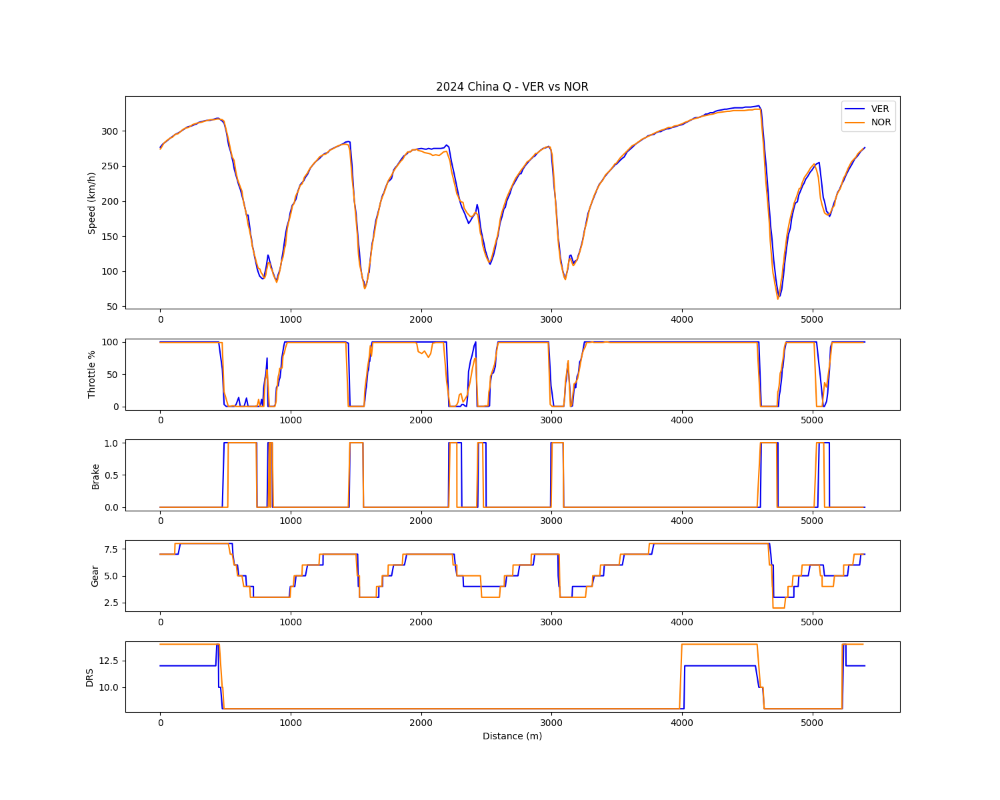
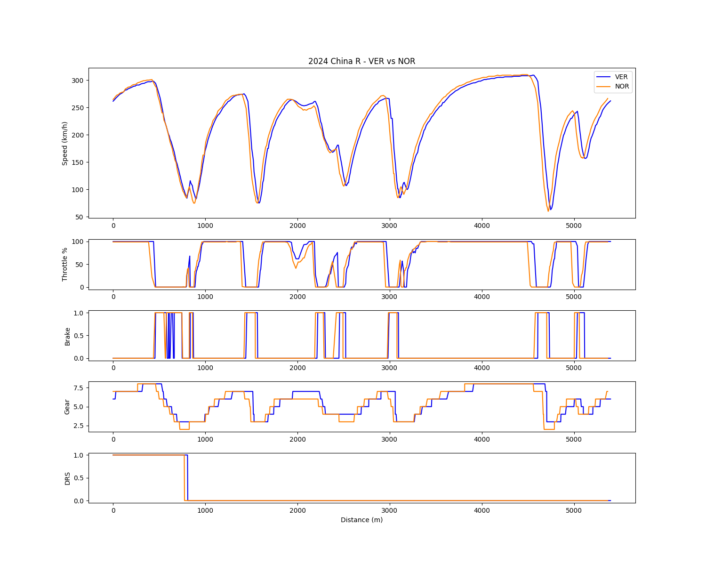
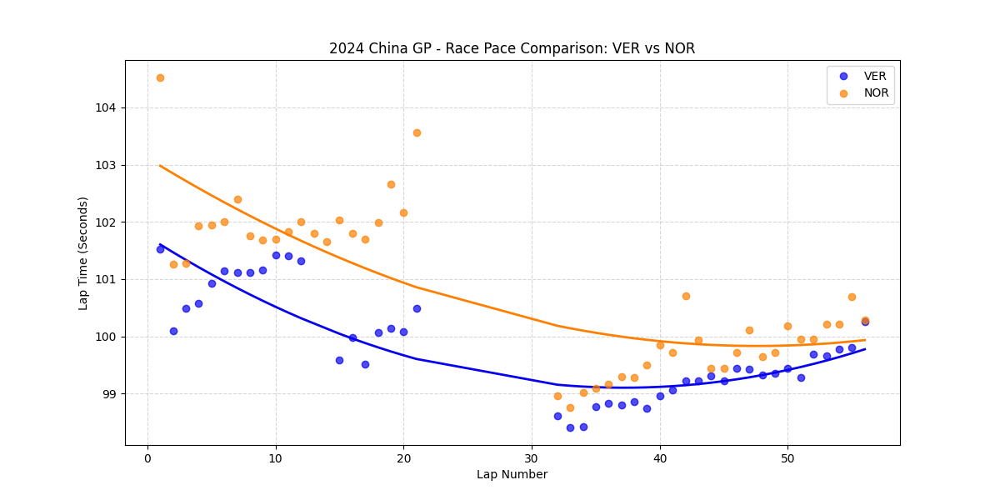

# Chapter 1: The Baseline - 2024 China GP Analysis
**The Legacy Deficit: Identifying the Aerodynamic & Mechanical Limitations**

## 1. Executive Summary
The 2024 Chinese Grand Prix serves as the critical "Control Group" for evaluating McLaren's developmental trajectory. Before the transformative Miami upgrade, the MCL38 exhibited a fundamental architectural flaw: a severe lack of front-end aerodynamic authority in low-speed, long-duration corners. This forced Lando Norris to adopt aggressive, tire-destroying driving inputs—specifically extreme engine-braking and delayed throttle application—merely to rotate the car. This established a massive race-pace delta against the aerodynamically stable Red Bull RB20, highlighting the mechanical crutch McLaren relied upon.

## 2. Micro-Telemetry Analysis: The Symptoms of Understeer

### A. The "Snail Complex" (Turns 1-4): Chronic Washout
* **Observation:** Entering the endless, tightening radius of Turns 1 through 4, Norris's minimum speed drops significantly lower than Verstappen's. Norris spends a prolonged period off the throttle, waiting for the front end to bite.
* **Analysis:** This complex exposes the MCL38's core weakness: entry-understeer. Without sufficient front downforce, Norris cannot carry speed into long corners. He is forced to coast and wait, losing massive amounts of time simply trying to get the car pointed at the apex.

### B. Engine Braking as a Rotation Crutch (Turn 14 Hairpin)
* **Observation:** Approaching the heavy braking zone of the Turn 14 hairpin, Norris consistently downshifts more aggressively and selects a lower minimum gear compared to Verstappen.
* **Analysis:** This is a forced mechanical compensation. Unable to rely on aerodynamic grip to turn the car, Norris uses aggressive downshifting (engine braking) to deliberately unsettle the rear tires, inducing an artificial oversteer to pivot the heavy chassis around the tight hairpin.

### C. Throttle Delay and Traction Deficit (Sector 2)
* **Observation:** Exiting mid-speed traction zones (like Turn 6 and Turn 11), Norris's throttle application trace is distinctly jagged and delayed, while Verstappen's is a smooth, linear ramp-up.
* **Analysis:** The artificial rotation technique (engine braking) severely destabilizes the rear axle. When Norris attempts to apply power, the rear tires lack the grip to accept the torque, forcing him to hesitate and stagger his throttle inputs to avoid spinning.

## 3. Macro Race Pace Analysis: Thermal Degradation

### A. The Degradation Cliff
* **Observation:** Over a full race distance, Norris's lap times feature a steep, aggressive drop-off trendline, whereas Verstappen maintains a remarkably flat and consistent pace.
* **Analysis:** The micro-telemetry perfectly explains this macro result. The constant fight to rotate the car via engine braking, sliding the rear end, and fighting traction out of corners inevitably overheats the surface of the rear tires. The MCL38 inherently destroys its own tires through compensation, confirming that Red Bull's 2024 advantage was rooted in platform stability.