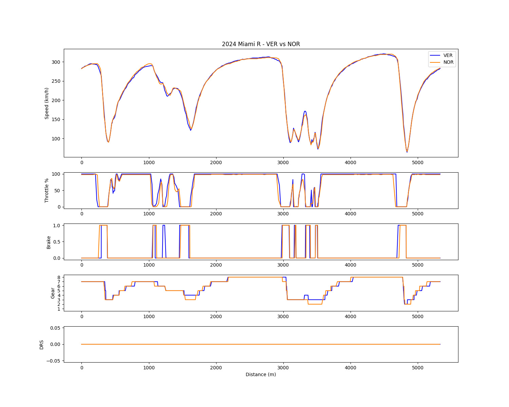
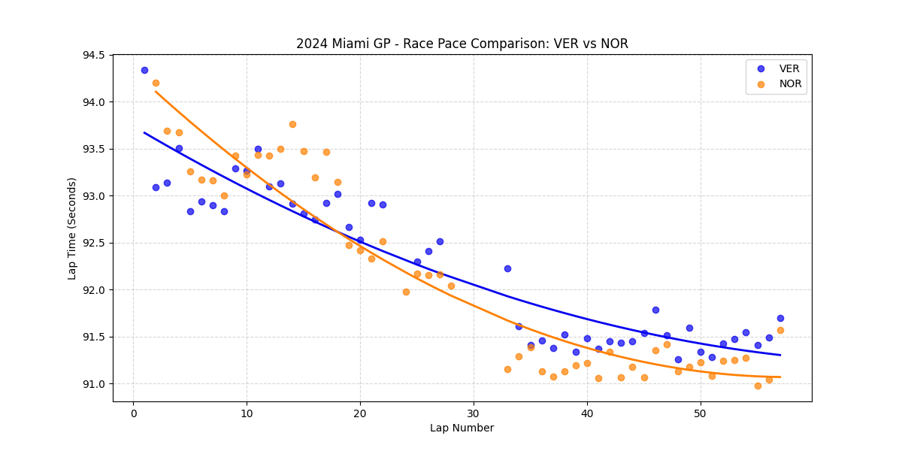

# Chapter 2: The Paradigm Shift - 2024 Miami GP Analysis
**The Aerodynamic Cure: Restoring Front-End Authority**

## 1. Executive Summary
The 2024 Miami Grand Prix represents the inflection point of McLaren's trajectory. The comprehensive upgrade package introduced here resolved the MCL38's architectural flaws observed in China. By stabilizing the aerodynamic platform and restoring front-end authority, McLaren eliminated the need for tire-destroying driving compensations. This allowed Lando Norris to match and ultimately overcome Red Bull's race pace, fundamentally shifting the championship dynamics.

## 2. Micro-Telemetry Analysis: The Stabilized Platform

### A. Eradication of the Gear Crutch (Turn 11-16 Complex)
* **Observation:** In the tight, slow-speed technical section of Sector 3 (Turns 11 through 16), the severe gear discrepancy seen in China is gone. Norris now navigates these corners using the same, or even higher, minimum gears as Verstappen.
* **Analysis:** The upgrade provided the necessary front-end downforce. Norris no longer needs to use extreme engine braking to artificially force the car's rotation; the MCL38 now turns naturally and predictably via aerodynamic grip.

### B. Seamless Throttle Application & Exit Speed
* **Observation:** Exiting critical traction zones, Norris's throttle traces have transformed from the jagged, hesitant lines seen in China to smooth, linear applications that match or beat Verstappen's inputs.
* **Analysis:** With a stable rear end and a front axle that bites willingly, Norris can deploy traction immediately at the apex. This stability eliminates the rear-wheel spin, drastically improving corner exit speeds and straight-line momentum.

## 3. Macro Race Pace Analysis: The Tire Advantage

### A. Reversing the Degradation Trend
* **Observation:** In the second half of the race, Norris maintains a remarkably flat pace trendline, while Verstappen's pace begins to suffer from degradation.
* **Analysis:** The eradication of the "engine-braking crutch" directly translates to superior tire preservation. Because Norris no longer has to slide the rear of the car to make the apex, he minimizes thermal degradation. He can now drive at a highly competitive pace without overheating the rubber, granting him the strategic superiority that secured his victory.