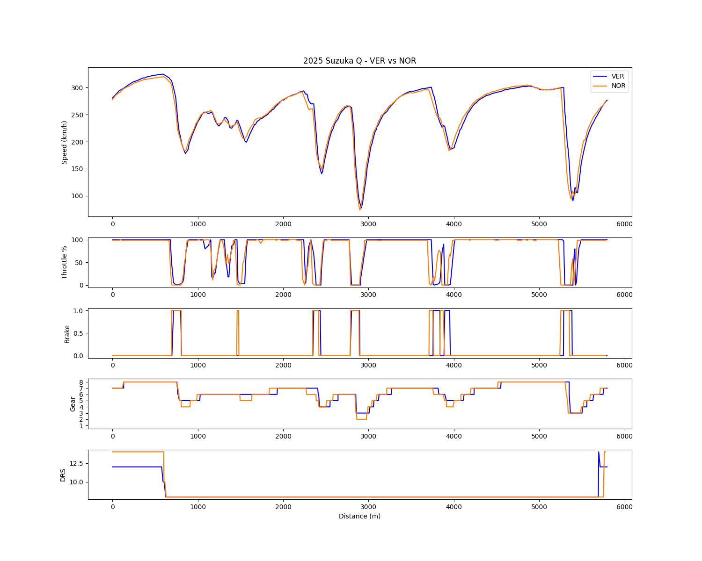
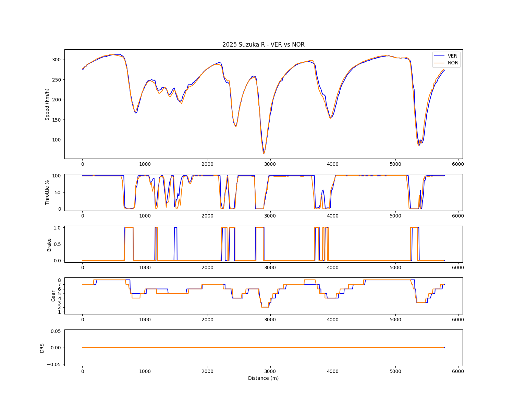
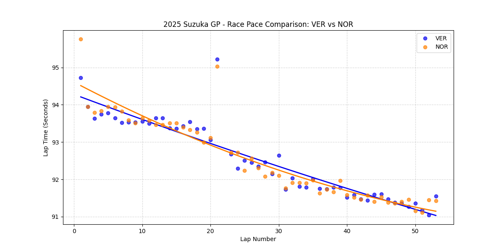

# Chapter 3: The Fortress Breached - 2025 Japan GP Analysis
**Neutralizing the Aerodynamic Stronghold: High-Speed Parity**

## 1. Executive Summary
The 2025 Japanese Grand Prix at Suzuka—historically the ultimate proving ground for Red Bull’s high-speed aerodynamic efficiency—marked a definitive paradigm shift. By cross-referencing qualifying inputs, high-fuel race telemetry, and overall race pace, the data proves that McLaren’s MCL39 completely neutralized the RB21's structural advantage. While Norris did not exhibit outright dominance in pure lap time, achieving mathematical parity on Red Bull's most favored circuit confirmed McLaren's all-encompassing versatility, laying the groundwork for a championship battle.

## 2. Micro-Telemetry Analysis: Qualifying (The Aero Deficit)

*(Analysis of absolute limit performance and platform stability)*

### A. The "S-Curve" Compromise (Turns 3-6)
* **Observation:** Through the high-speed directional changes of the S-Curves, Verstappen is forced into significant throttle lifts (e.g., dropping significantly at T5 and utilizing a prolonged lift at T6). Norris maintains ~50% throttle through T5 and utilizes a highly advanced, instantaneous brake input (pitch-control) at T6.
* **Analysis:** Red Bull was forced to run a lower-drag setup to maintain Sector 1 straight-line speed, severely compromising high-speed downforce. Verstappen's lifts are survival mechanisms against centrifugal force. Norris's trace confirms massive aerodynamic grip, allowing him to carry minimum speed and manipulate vehicle pitch seamlessly.

### B. Spoon Curve Deficit (Turn 13-14)
* **Observation:** Approaching Spoon, Verstappen's braking phase is nearly twice as long as Norris's. Norris initiates deceleration later, completes it faster, and shifts his acceleration profile to the left (earlier throttle application).
* **Analysis:** This confirms chronic entry-understeer for the RB21. Verstappen must drag the brake to force the nose into the apex. The MCL39’s stable aero platform allows Norris to rotate the car effortlessly and deploy traction immediately.

### C. Aggressive Gear Mapping
* **Observation:** Norris consistently navigates low-speed and medium-speed corners (excluding T9 and the Chicane) one gear lower than Verstappen.
* **Analysis:** Unlike the 2024 China GP where low gears were used for engine-braking rotation, here Norris is proactively exploiting the MCL39's superior rear traction, utilizing the lower gear's torque to maximize exit velocity without unsettling the rear axle.

## 3. Race Telemetry Analysis: High-Fuel Dynamics

*(Analysis of driver adaptation under heavy fuel and tire degradation)*

### A. Lift-and-Coast vs. Overdriving (Sector 1)
* **Observation:** In race conditions, Verstappen matches or exceeds Norris's minimum speeds through the S-Curves, while Norris lifts earlier and deploys less throttle overall. Verstappen even utilizes the brake at T6, reversing the qualifying dynamic.
* **Analysis:** This is a masterclass in thermal management by Norris. Aware of Suzuka's extreme left-front tire degradation, Norris utilizes "lift and coast" to preserve rubber. Verstappen’s higher speeds here are not an advantage; they are the result of overdriving the RB21, forcing the car through the sector and accelerating tire wear.

### B. Cadence Braking vs. Block Shifting (Spoon & Chicane)
* **Observation:** At Turn 13, Verstappen’s deceleration is lethargic, while Norris executes three distinct, micro-brake inputs. At the final Chicane, Verstappen drops gears simultaneously at the last moment (block shifting).
* **Analysis:** Norris’s "cadence braking" at Spoon perfectly balances the car's pitch on a downhill entry—a technique only possible with supreme platform stability. Verstappen's lethargic braking at Spoon (due to understeer) and sudden block-shifting at the Chicane highlight a profound lack of confidence in the RB21’s rear-end stability under heavy load transfer.

## 4. Macro Race Pace Analysis: The Ultimate Draw

*(Analysis based on a 53-lap macro pace scatter plot)*

### A. Strategic Anomalies
* **Observation:** Both drivers exhibit a massive, identical time drop around Laps 21-22. Additionally, Verstappen shows a significant pace drop at Lap 30, followed immediately by 3-4 highly competitive laps.
* **Observation:** Norris loses significant time on Lap 24 and the final Laps 53-54. 
* **Analysis:** The Lap 21-22 synchronization is a clear Virtual Safety Car (VSC) deployment. Verstappen's Lap 30 trace is the structural footprint of a pit stop, followed by the aggressive exploitation of new tire grip (an undercut/overcut attempt). Norris’s late-race drop-offs (L53-54) represent strategic cruising to preserve power unit mileage once the position was secured.

### B. The Convergence of Trendlines
* **Observation:** Over the full race distance, the trendlines of both drivers are virtually identical. Verstappen starts marginally faster, Norris converges in the mid-phase, and both end the race consistently hitting the 91.0s mark.
* **Analysis:** While Norris did not build a dominant gap, achieving a mathematical "draw" on tire degradation and pace at Suzuka is the ultimate victory for McLaren. By entirely erasing the massive 20-second delta Red Bull enjoyed in previous years, the MCL39 proved it could neutralize Red Bull's core aerodynamic philosophy, shifting the championship momentum irreversibly.