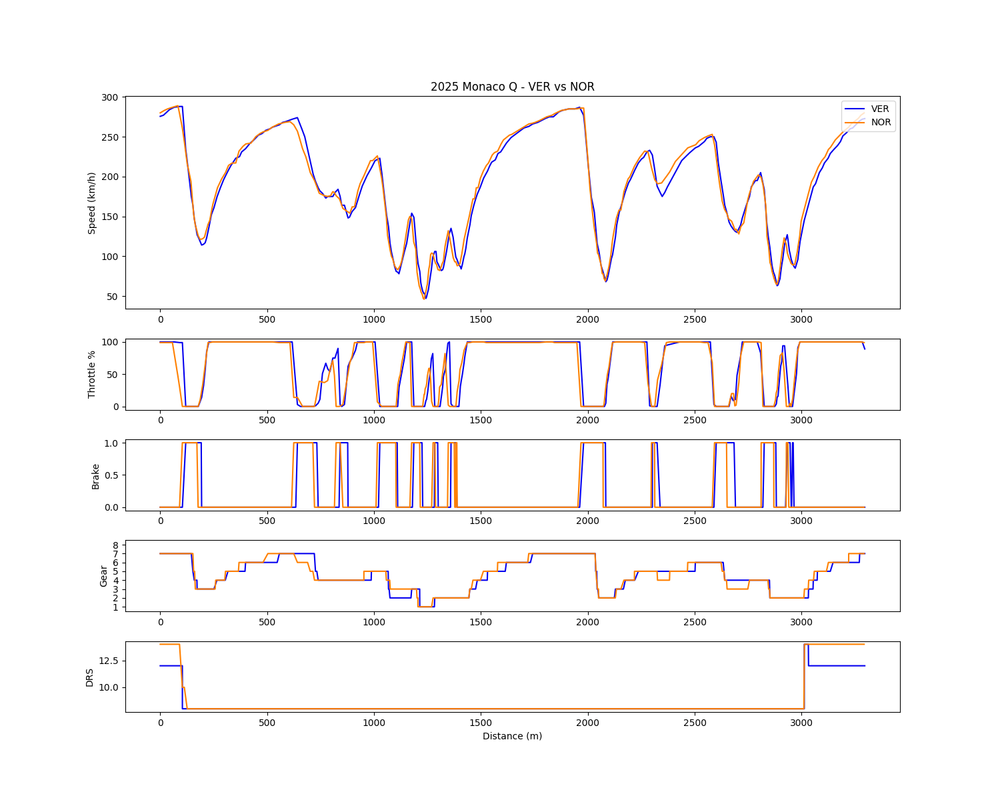
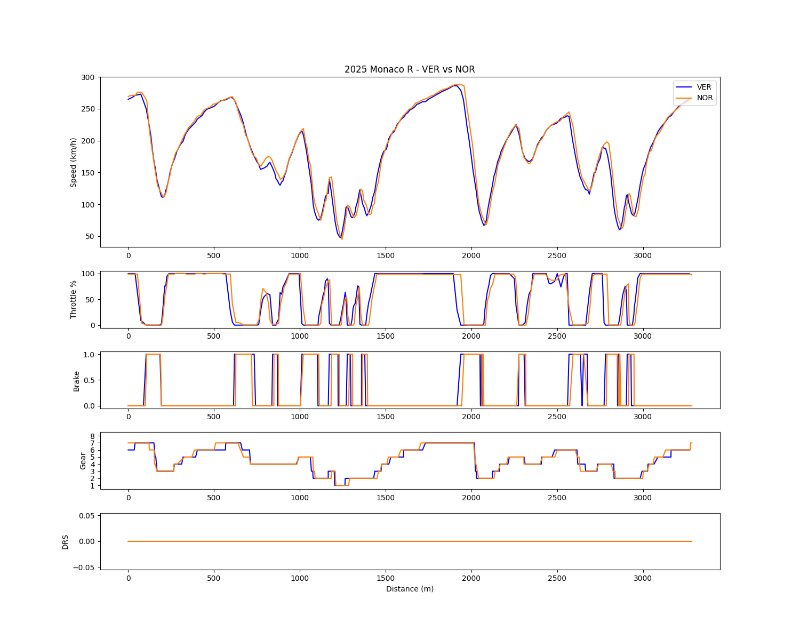
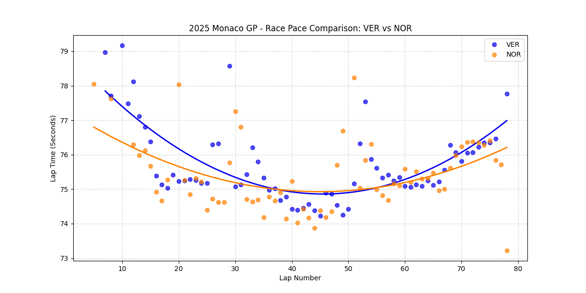

# Chapter 4: The Architectural Reversal - 2025 Monaco GP Analysis
**Dominance on Technical Trajectories**

## 1. Executive Summary
This case study of the 2025 Monaco GP provides definitive proof that McLaren’s MCL39 eradicated the low-speed rotation deficits that plagued its predecessor. By cross-examining micro-telemetry (qualifying/race) with macro-race pace, the data exposes a profound architectural reversal: Lando Norris utilized a highly stable aerodynamic platform to preserve tires and dominate, while Max Verstappen and the Red Bull RB21 were forced into aggressive, tire-destroying driving inputs merely to survive. Monaco was not just a victory; it was the engineering blueprint of McLaren's championship run.

## 2. Micro-Telemetry Analysis: Eradicating the Legacy Deficit

### A. Braking Profile & Platform Stability
* **Observation:** Telemetry shows a fundamental reversal of the 2024 dynamic. Norris (MCL39) utilizes an earlier, smoother braking graduation, entering corners with a stable aerodynamic platform. Conversely, Verstappen (RB21) is forced into aggressive, jagged braking inputs—spending up to 2x more duration on the pedal at T4, T12, and T15.
* **Analysis:** Verstappen's severe entry understeer and prolonged braking confirm that the RB21 requires extreme force to rotate, inducing platform instability. Norris's smooth trace proves that the MCL39's front-end bite is now structurally superior, allowing him to carry higher minimum speed without unsettling the car.

### B. Aggressive Gear Exploitation & Traction (T12 & T15)
* **Observation:** At Turn 12 (Tabac) and Turn 15 (Pool Exit), Norris deliberately selects one gear lower than Verstappen (4th vs 5th, and 3rd vs 4th), while maintaining superior acceleration and higher corner speed.
* **Analysis:** Unlike the reactive, desperate gear drops seen in China 2024, this is a proactive exploitation of the MCL39's massive downforce. Keeping the engine in peak RPM bands allows Norris to maximize corner-exit torque and traction, destroying Verstappen's speed profile out of Turn 12.

### C. Handling Deficit at T3 (Massenet)
* **Observation:** Verstappen persists in 7th gear through the high-speed entry of Massenet, followed by a panic-shift to 4th at T4. Norris executes sequential, progressive downshifting.
* **Analysis:** Verstappen’s reliance on a higher gear suggests a highly nervous rear-axle geometry under sudden load shifts; dropping gears would trigger rear instability. Norris's linear downshifting highlights a highly predictable, aerodynamically balanced package.

### D. DRS Efficiency
* **Observation:** No significant delta is observed in DRS deployment timing or straight-line delta between both drivers.
* **Analysis:** The clear system advantage Red Bull held in 2024 (immediate DRS engagement) has been completely neutralized by McLaren's drag-reduction optimization, leaving the RB21 with zero structural defense.

## 3. Race Telemetry Analysis: High-Fuel Dynamics & Driver Adaptation

The examination of the race fastest laps reveals how both drivers adapted to their vehicle limitations over a full grand prix distance with heavier fuel loads.

### A. The "Distance Shift" & Geometrical Line Selection
* **Observation:** The entire telemetry profile of Norris (MCL39) exhibits a consistent lateral right-shift relative to Verstappen (RB21).
* **Analysis:** This spatial delta indicates a distinct lineage in racing lines during the race session. Norris utilized a wider, more progressive entry geometric arc—effectively increasing the total traveled distance per lap—to maximize mid-corner rolling speed (V-min). Verstappen was forced into tighter, geometric v-shaped entries to compensate for structural laziness in front-end rotation.

### B. Micro-Interventions at Technical Sectors
* **Turn 4-5 Deficit:** Verstappen shows a catastrophic velocity drop between T4 and T5, confirming that the high-fuel sloshing effects exacerbated the RB21’s chronic understeer.
* **Turn 6 (Hairpin) & Turn 12 Power-Sliding:** At the ultra-low-speed Fairmont Hairpin (T6), Verstappen surprisingly matches or slightly exceeds Norris's minimum speed, supported by an immediate, aggressive throttle spike. This is highly indicative of "throttle-steering"—Verstappen intentionally inducing rear wheelspin to force car rotation, a brute-force tactic that inevitably accelerates rear tire thermal degradation.
* **Turn 15 (Chicane Exit) Instability:** Approaching the exit of the Swimming Pool complex (T15), Verstappen’s throttle trace shows violent, high-frequency oscillations coupled with a double brake-pedal input. This is clear evidence of the RB21 violently bottoming out over the curbs. Verstappen had to modulate both pedals simultaneously to prevent a snap-spin. Norris mitigates the same section with a single, synchronized lift, proving the MCL39’s superior damping and platform compliance.

### C. Advanced Pitch Control via Trail-Braking (T10 & T18)
* **Observation:** Norris executes a unique secondary "micro-brake input" immediately after finishing his primary deceleration phase into Turn 10 and Turn 18.
* **Analysis:** This represents the pinnacle of proactive pitch-management. By softly dragging the brake pedal a second time right at the turn-in apex, Norris dynamically pins the front axle down, maximizing the contact patch of the front tires exactly when maximum lateral rotation is required.

## 4. Macro Race Pace Analysis: The Degradation Cliff

The race pace scatter plot flawlessly translates the micro-telemetry advantages into macro-strategic dominance over the 78-lap distance.

### A. Mid-Race Convergence & Traffic Anomalies
* **Observation:** Norris's plot shows distinct upward spikes around Lap 20 and Lap 52. Between Laps 30-50, Verstappen matches or slightly exceeds Norris’s pace, creating a convergence in the trendlines.
* **Analysis:** The lap 20/52 spikes are statistical outliers entirely dictated by blue-flag traffic management (clearing backmarkers) on the narrow street circuit. Verstappen’s competitive mid-phase pace was achieved by pushing the RB21 to its absolute mechanical limit as fuel loads decreased, attempting to force a strategic pit-window crossover.

### B. Late-Race Degradation & The "Glory Lap"
* **Observation:** From Lap 60 onwards, Verstappen's trendline arcs aggressively upward, losing over 1.5 seconds of pace. Norris's trendline remains exceptionally flat. On Lap 78, Norris drops a staggering 73.0s fastest lap.
* **Analysis:** This is the ultimate consequence of the telemetry findings. Verstappen's reliance on "throttle-steering" and heavy braking earlier in the race completely destroyed his rear tires, pushing him off the degradation cliff. Norris, having preserved his tires via stable aerodynamics and smooth trail-braking, had massive reserves remaining, allowing him to deploy a full ERS-assisted qualifying-style lap at the very end of the grand prix.