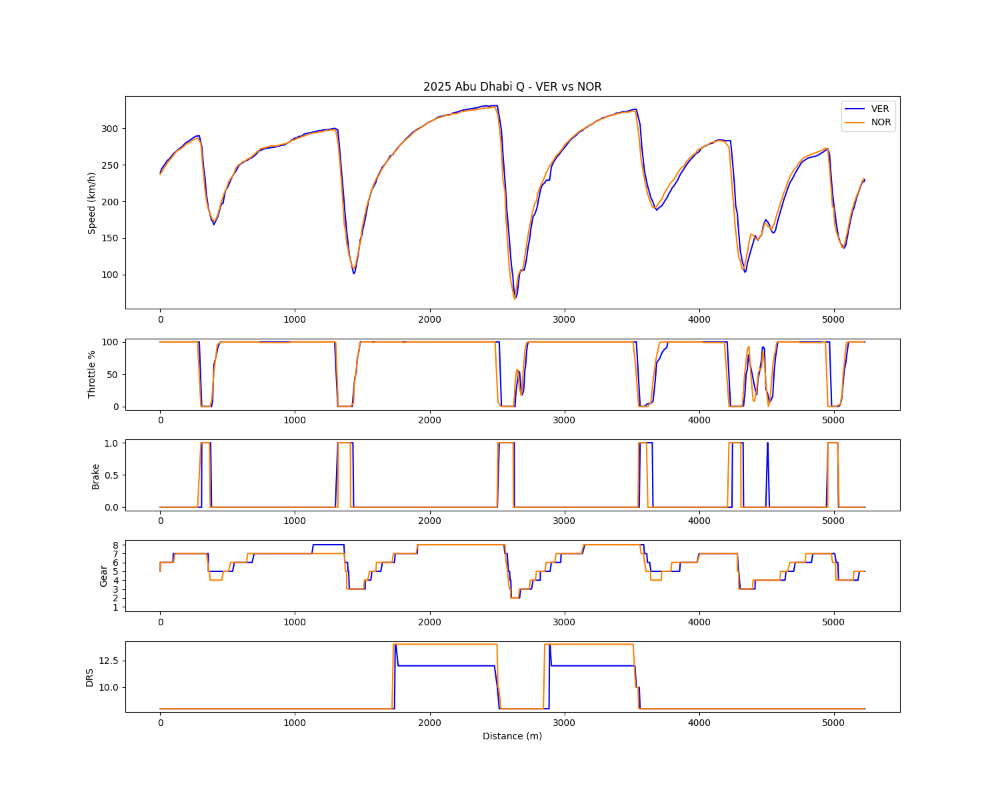
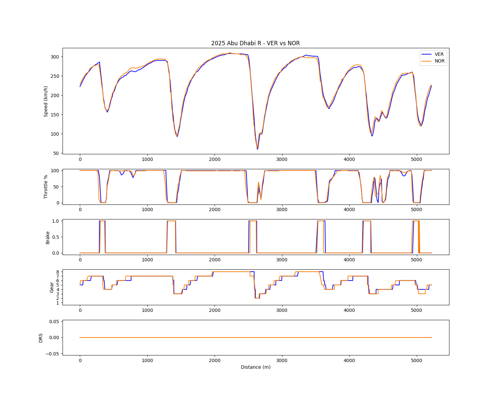
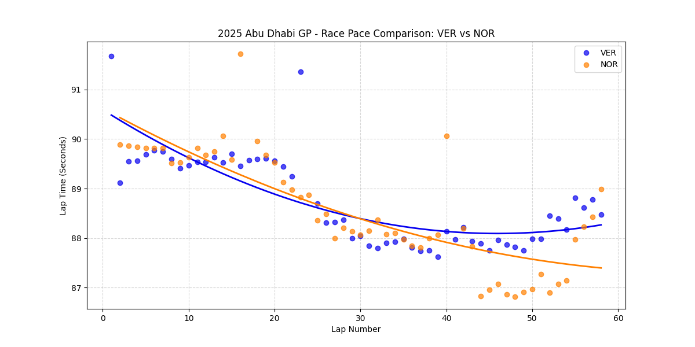

# Chapter 5: The 2-Point Margin - 2025 Abu Dhabi GP Analysis
**The Ultimate Compromise: Extreme Defense vs. Strategic Prudence & Structural Flaws**

## 1. Executive Summary
The season finale at Abu Dhabi perfectly encapsulated the 2025 championship battle. Facing a structurally superior McLaren MCL39, Red Bull was forced into a desperate strategic corner: stripping the RB21 of downforce to guarantee straight-line speed, solely to defend track position. While this allowed Verstappen to execute an absolute masterclass in defensive driving, it destroyed his tires. McLaren and Norris, recognizing the impossibility of a safe on-track overtake against a low-drag setup, opted for strategic prudence. By prioritizing the championship over a risky race win, McLaren executed an offset pit strategy, allowing Norris to secure the crown by a mere 2-point margin. Simultaneously, the race exposed a fatal organizational flaw within Red Bull—their inability to mount a multi-car defense utilizing the second seat, highlighting the ultimate collapse of their single-driver developmental philosophy.

## 2. Micro-Telemetry Analysis: The Low-Downforce Gamble

*(Based on Qualifying & Race Telemetry dynamics)*

### A. The "Straight-Line Shield" Setup
* **Observation:** Telemetry reveals Verstappen holding a distinct top-speed advantage at the end of the main straights (e.g., T1 to T5, and T13-T14). However, Norris completely dominates minimum cornering speeds and exit traction, particularly in the highly technical Sector 3.
* **Analysis:** Red Bull deliberately compromised their aerodynamic platform. By running an extreme low-downforce configuration, they turned the RB21 into a "straight-line shield," calculating that if Verstappen secured track position, the narrow nature of Yas Marina would prevent Norris from overtaking, despite McLaren's superior overall pace.

### B. Platform Collapse: The Turn 9 Death Wiggle

* **Observation:** Under heavy fuel load during the race, Verstappen’s throttle trace at Turn 9 exhibits severe instability (sharp application → sudden lift → re-application). Norris continues to utilize smooth trail-braking (e.g., Turn 16) and proactive block-shifting without unsettling the car.
* **Analysis:** Verstappen's erratic throttle input at T9 is the physical manifestation of "snap oversteer." Lacking rear downforce, the RB21's rear axle attempts to break traction violently on exit, forcing Verstappen to counter-steer and lift. This singular dynamic explains the catastrophic thermal degradation Red Bull suffered in the race's second half.

## 3. Macro Race Pace Analysis: The Psychological War

*(Based on the 58-lap Race Pace scatter plot)*

### A. The Degradation Cliff and Defensive Masterclass
* **Observation:** Verstappen's race pace trendline slopes upwards aggressively in the second half of the race, indicating severe tire degradation. 
* **Analysis:** The "Turn 9 death wiggle" and the lack of aero-grip completely destroyed the RB21's rear tires. The fact that Verstappen maintained track position despite this massive pace deficit is a testament to extraordinary defensive car placement and the effectiveness of the low-drag straight-line setup. 

### B. Lap 40: The Championship-Securing Pit Stop
* **Observation:** Norris trails Verstappen’s pace until Lap 40, after which McLaren initiates a pit stop. Post-Lap 40, Norris’s lap times drop significantly, establishing a massive pace delta over Verstappen.
* **Analysis:** This was the definitive strategic psychological maneuver of the race. McLaren realized that overtaking the low-drag Red Bull on track carried an unacceptable risk of a collision (which could cost them the championship). Instead of forcing the issue, McLaren executed a "safety-first" pit stop. They traded track position for an overwhelming tire delta, ensuring Norris could safely shadow Verstappen to the flag and secure the championship by the narrowest 2-point margin. Data proves it wasn't a lack of pace from McLaren, but a calculated sacrifice to win the ultimate prize.

## 4. Strategic Verdict: The "Second Seat" Paradox
The hidden narrative of Abu Dhabi lies in what Red Bull *failed* to execute. To definitively secure the championship for Verstappen and force Norris down the order, Red Bull required a multi-car blockade—utilizing Yuki Tsunoda (RB21) as a rear-gunner to back Norris into the VCARB (Lawson/Hadjar) traffic or the Ferrari threat. 

However, this theoretical "Plan Tsunoda" was dead on arrival. For it to work, the second RB21 had to qualify ahead of Norris. The failure to achieve this is not merely a reflection of driver capability, but a damning indictment of Red Bull's organizational structure. Developing a chassis strictly around Verstappen’s extreme handling preferences—and further compromising it with a volatile low-downforce setup in Abu Dhabi—resulted in a car that was virtually undriveable for the second driver. 

Red Bull did not just lose the championship on track; they lost it in their engineering philosophy. By sacrificing the drivability of the second car, they dismantled their own strategic flexibility, leaving Verstappen entirely isolated against a mathematically superior McLaren operation.