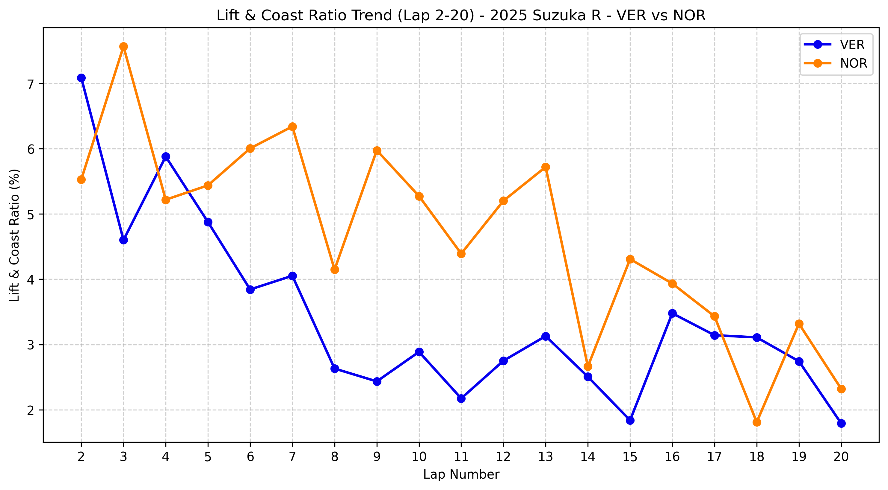
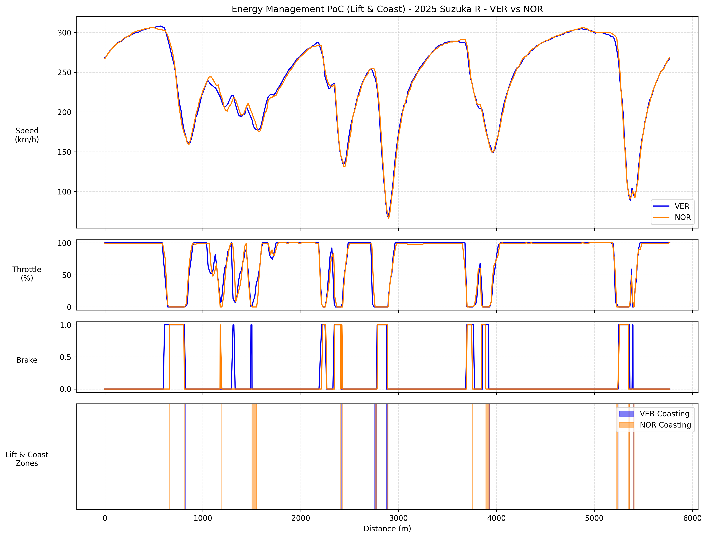

# Chapter 6: Redefining Aerodynamic Efficiency - 2025 Japan GP Analysis
**The Correlation Between Platform Stability and Energy Regeneration Ahead of the 2026 PU Regulations**

## 1. Executive Summary
With the introduction of the new 2026 regulations, where the power output ratio between the Internal Combustion Engine (ICE) and the electric motor (MGU-K) shifts to 50:50, the decisive factor in the next generation of Formula 1 will no longer be pure peak PU power. Through the telemetry analysis of McLaren (MCL39) and Red Bull (RB21) at the 2025 Japanese GP, this report proves that the "energy regeneration efficiency enabled by aerodynamic platform stability (Lift & Coast tolerance)" will become the most critical KPI. McLaren achieved overwhelming fuel and electrical energy conservation compared to Red Bull without sacrificing any lap time at Suzuka, establishing the optimal vehicle development solution for 2026 and beyond.

## 2. Macro Trend Analysis: Stint Progression and Strategic Intent

*(Analysis of Lift & Coast execution ratio and tire degradation tolerance during the first stint)*

### A. Baseline Superiority and the Emergence of Degradation
* **Observation:** From the early stages, Norris consistently maintains a higher Lift & Coast (L&C) ratio than Verstappen. From Lap 6 onwards, Verstappen's L&C ratio drops sharply to the 2% range, while Norris maintains a high L&C ratio of around 5% until Lap 13.
* **Analysis:** This highlights the fundamental package differences. As tire thermal degradation progresses, Verstappen loses his energy management margin, forced into "overdriving" (heavily relying on throttle and brake inputs) to compensate for the loss of rear grip. Norris's sustained high ratio proves the MCL39's baseline aerodynamic superiority, allowing him to save energy without disrupting the car's attitude.

### B. Tactical Deployment Release (Lap 18)
* **Observation:** On Lap 18, Norris's L&C ratio suddenly plummets to approximately 1.8%, aligning closely with Verstappen's trace before rebounding.
* **Analysis:** This is not an anomalous fluctuation, but a deliberate tactical execution. Norris fully deployed (100% push) the MGU-K energy he had accumulated through L&C in the middle phases to gain a strategic advantage (undercut/overcut) during the critical pit stop window.

## 3. Micro Telemetry Analysis: Sector-Specific Pedal Behavior

*(Analysis of micro-level pedal inputs and regeneration efficiency during the Lap 15 cruising phase)*

### A. Extreme Thermal Management at Turn 6 (End of the S-Curves)
* **Observation:** Through the rapid direction changes at Turn 6, Norris clears the corner entirely by coasting (throttle fully closed, zero brake application). In contrast, Verstappen maintains throttle application while simultaneously dragging the brakes.
* **Analysis:** In the sector that imposes the highest load on the front-left tire at Suzuka, Norris perfectly executes thermal management. By utilizing a long L&C phase, he controls entry speed to prevent tire surface temperature spikes. Verstappen's pedal operation is a brute-force survival mechanism to stabilize the RB21, resulting in aggressive tire degradation.

### B. Reversal of Regeneration Efficiency (Spoon Curve Entry)
* **Observation:** On the downhill approach to Spoon Curve, Norris executes L&C over roughly twice the distance (and time) compared to Verstappen. Despite this, the bottom speed (minimum cornering speed) of both drivers remains identical.
* **Analysis:** Running a trimmed rear wing, the RB21 is highly susceptible to rear-end instability under braking. Verstappen must keep the throttle open until the absolute limit to maintain aerodynamic sealing via exhaust flow, forcing a V-shaped cornering line. Conversely, the immense downforce and platform stability of the MCL39 afford Norris the luxury of lifting off earlier (initiating MGU-K regeneration). Supported by a high cornering limit, Norris can coast for an extended duration and carry a high bottom speed through a U-shaped line.

## 4. Conclusion & 2026 Outlook
This analysis demonstrates that even Verstappen's exceptional overdriving capabilities can no longer compensate for an overwhelming physical deficit in energy management.

Under the new 2026 regulations, where the significance of MGU-K deployment matches ICE thermal efficiency, the total PU output will be dictated by "how much coasting distance (L&C) the car can afford the driver for regeneration." Designing a stable aerodynamic platform that allows the car to coast without dropping lap times is the absolute prerequisite for maximizing next-generation PU performance and securing the championship.